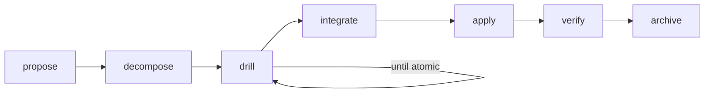
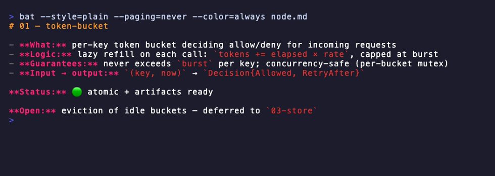
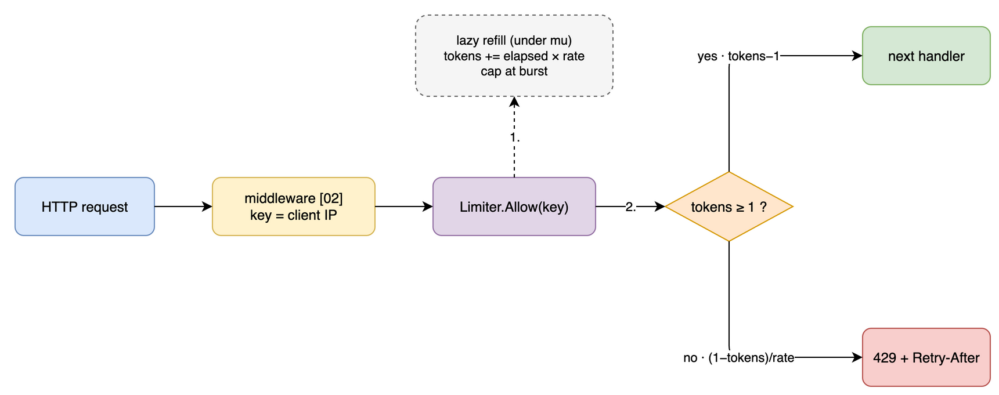
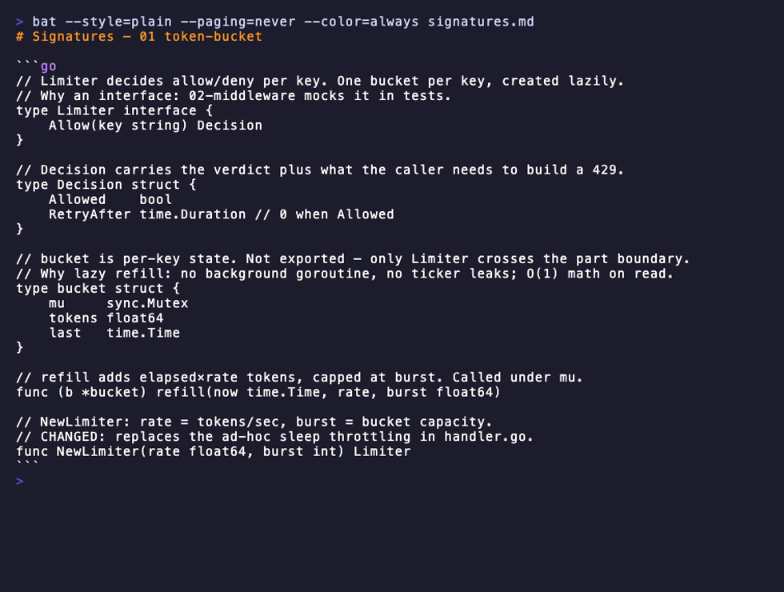

<div align="center">

# 🔷 PRISM

**Stop letting your AI agent one-shot 2000-line changes it doesn't understand.**

*Recursive decomposition workflow for AI coding agents — turn a vague idea into an implemented,
verified change through small, confirmable steps.*

[](https://github.com/mcoder33/prism/actions/workflows/ci.yml)
[](https://go.dev)
[](LICENSE)
[](https://github.com/mcoder33/prism/pulls)
[](#supported-tools)
[](#supported-tools)
[](#supported-tools)

</div>

<div align="center">


</div>

## The problem

You ask an AI agent for a non-trivial feature. It either:

- **dives straight into code** and you discover its (wrong) design decisions in a 1500-line diff, or
- **writes a 10-page design doc** that you skim, approve without really reading, and that drifts
  from reality by step three.

Both fail the same way: **the unit of review is too big**. Humans are great at judging one small,
concrete decision — and terrible at auditing a wall of text or a mega-diff.

## The PRISM way

PRISM splits design into **small recursive nodes** — one digestible `node.md` at a time, each with
an explicit decision gate. The agent proposes, you react, it drills deeper. Nothing gets implemented
until every node is **atomic** — small enough to be obviously right.



The core principles, baked into every command:

- **Decision-first, not analysis-first.** Not *"here are 3 options, you weigh them"* —
  but *"I propose X because Y; rejected B/C in one line."* One thing to react to.
- **One small node at a time.** You never face the whole analysis at once.
- **Recursive decomposition** until a node becomes obvious.
- **Grounded in real code** — the agent reads your codebase before designing, never in a vacuum.
- **No big upfront docs.** They overwhelm and get skimmed. Forbidden by convention.

## Quick start

```bash
go install github.com/mcoder33/prism@latest
cd your-project
prism init          # interactive TUI — pick your agents
```

Then, inside your agent:

```
/prism:propose      # describe the problem, get a 1-screen seed proposal
/prism:decompose    # split into 2-4 small parts
/prism:drill        # drill ONE part until atomic (spec, detail, diagram, tasks)
/prism:integrate    # cross-part wiring: integration diagram + combined signatures
/prism:apply        # implement part-by-part, one commit per part, checks after each
/prism:verify       # pedantic QA on a running dev env: tests, smoke, concurrency, load
/prism:status       # where am I — phase, node table vs reality, the one next action
```

All design artifacts live in `.prism/` at the repo root — **git-excluded automatically**,
it's local working state, never committed.

## Inside a drilled node

`/prism:drill` takes **one part** and brings it to atomic. It writes the `node.md` digest first
and **stops at a gate** — you react to the digest and the proposed artifact set before anything
else is generated (trivial nodes skip the diagram and spec). Here's what that looks like for a
`01-token-bucket` node of a rate-limiter change — three artifacts carry the weight:

**`node.md` — the unit of review.** 5-7 lines. You react to *this*, not to a design doc:

<p align="center"></p>

**`concept.drawio` — a real diagram, not ASCII art.** The agent hand-crafts mxGraph XML and
validates it with `xmllint`. Open it in draw.io or the VS Code extension:

<p align="center"></p>

**`signatures.md` — the API before any code.** Signatures + what/why comments, no implementation.
Catch a bad interface here, where changing it costs nothing:

<p align="center"></p>

Plus `spec.md` (Requirement/Scenario — they drive the tests later) and `tasks.md` (the checklist
`apply` executes). If a node turns out too big — drill redirects to `decompose` instead of
patching on the fly.

## What you get per change

```
.prism/<change>/
├── proposal.md          Why / What / Constraints / Decisions / Non-goals  (< 1 screen)
├── concept.md           surveyed best practices + chosen/rejected strategies
├── data-flow.drawio     conceptual data-mutation chain
├── 01-parser/           ← a node
│   ├── node.md          5-7 line digest — the unit of review
│   ├── spec.md          requirements as Requirement/Scenario
│   ├── detail.md        decision-complete implementation plan
│   ├── signatures.md    code sketch: signatures + what/why
│   └── tasks.md         checklist the agent executes
├── 02-renderer/         ← another node (drills into 02a, 02b... if needed)
├── integration.drawio   how the parts connect
└── tasks.md             root order + cross-cutting concerns only
```

Switch between concurrent changes like git branches: `/prism:use` persists the active change
in `.prism/CURRENT`, and every command targets it automatically.

## Supported tools

One `prism init` installs native slash commands for every agent you use — same methodology,
shared `.prism/` state, so you can **propose in Claude Code and apply in Cursor**.

| Tool | Commands | Invocation |
|---|---|---|
| **Claude Code** | `.claude/commands/prism/` | `/prism:propose` |
| **Cursor** | `.cursor/commands/` | `/prism-propose` |
| **Codex CLI** | `.codex/prompts/` | `/prism-propose` |
| **Gemini CLI** | `.gemini/commands/prism/` | `/prism:propose` |
| **GitHub Copilot** | `.github/prompts/` | `/prism-propose` |
| **Windsurf** | `.windsurf/workflows/` | `/prism-propose` |
| **OpenCode** | `.opencode/command/` | `/prism-propose` |

Adding a tool is one `adapters.Tool` value ([internal/adapters/adapters.go](internal/adapters/adapters.go)) —
file path + naming + frontmatter format. PRs welcome.

## How is this different from OpenSpec / spec-kit?

[OpenSpec](https://github.com/Fission-AI/OpenSpec) and [spec-kit](https://github.com/github/spec-kit)
pioneered spec-driven AI development, and PRISM borrows the installer model from them.
The difference is the shape of the artifact:

|  | Spec-driven (OpenSpec, spec-kit) | **PRISM** |
|---|---|---|
| Unit of review | a spec document | a **5-7 line node** |
| Structure | flat: spec → tasks | **recursive tree**, drill until atomic |
| Decision style | options to evaluate | **one decision to react to** |
| Depth control | fixed | per-node — drill only where it's murky |
| Post-implementation | done at merge | **`verify`**: tests, smoke, concurrency, load |

If your changes are small, spec-driven is enough. PRISM earns its keep on changes where the
design itself is the risk: refactors, new subsystems, concurrency, integrations.

## CLI reference

```bash
prism init [path] [--tools claude,cursor|all]   # install commands (TUI without --tools)
prism update [path] [--force]                   # regenerate after a CLI upgrade
prism list [path]                               # list active changes in .prism/
```

Generated files are **tool-owned**: each carries a `prism:generated v<version>` stamp and is
overwritten wholesale by `prism update` — edit [templates/](templates/), not the output.

Single static binary, zero runtime dependencies, templates embedded via `go:embed`.

## Development

```bash
make ci          # everything CI runs: test -race, vet, lint, vuln, mod-check
make test        # just the tests
make cover       # tests + coverage summary
make install     # build + put `prism` on PATH
make help        # list all targets

prism init --tools claude /tmp/sandbox        # smoke test
```

CI (GitHub Actions) runs the same five checks on every push and PR; `lint` and `vuln`
auto-install their tools, so a fresh clone only needs Go.

Layout:

```
main.go                      entrypoint → internal/cli
templates/                   tool-neutral command bodies + shared conventions (go:embed)
internal/
  workflows/                 command registry (id, title, description) + Version
  adapters/                  per-tool: paths, slash-command naming, frontmatter
  installer/                 detection, rendering, writing, git-exclude
  cli/                       cobra commands + bubbletea TUI
```

Stack: Go stdlib + [cobra](https://github.com/spf13/cobra) +
[bubbletea](https://github.com/charmbracelet/bubbletea)/[lipgloss](https://github.com/charmbracelet/lipgloss).

## License

[MIT](LICENSE)

---

<div align="center">

**If PRISM saves you from one bad mega-diff, consider a ⭐ — it helps others find it.**

</div>
